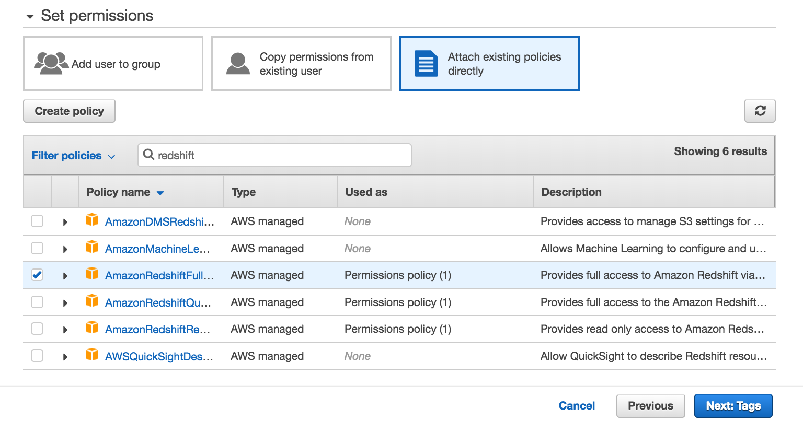
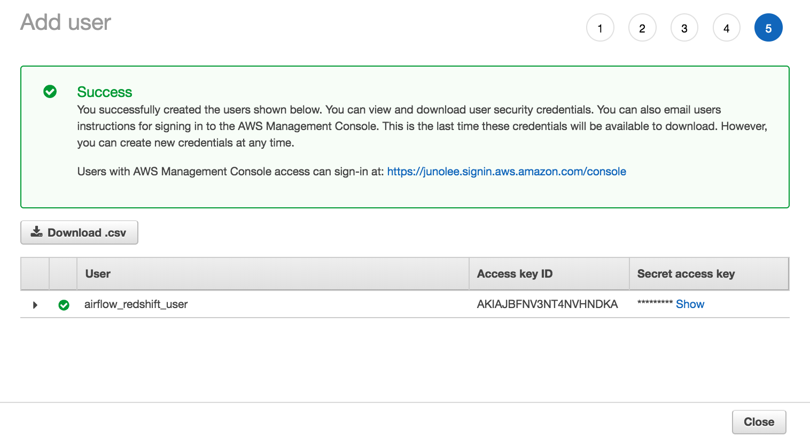

## Create an IAM User
Here, you'll create an IAM user that you will use to access your Redshift cluster.

1. Sign in to the AWS Management Console and open the IAM console at https://console.aws.amazon.com/iam/.
2. In the left navigation pane, choose Users.
3. Choose Add User.

4. Enter a name for your user (e.g. `airflow_redshift_user`)
5. Choose Programmatic access, then choose Next: Permissions.

6. Choose Attach existing policies directly.
7. Search for redshift and select AmazonRedshiftFullAccess. Then, search for S3 and select AmazonS3ReadOnlyAccess. After selecting both policies, choose Next: Tags.
8. Skip this page and choose Next: Review.

9. Review your choices and choose Create user.

10. Save your credentials! This is the only time you can view or download these credentials on AWS. Choose Download .csv to download these credentials and then save this file to a safe location. You'll need to copy and paste this Access key ID and Secret access key in the next step.

We strongly advise you to keep this Access key ID and Secret access key closely guarded, including not putting them in a GitHub public repo, etc.

As of June 2020, the AWS Management Console's UI has slightly changed. You can find the updated documentation on IAM roles here.
