## Create a PostgreSQL DB Instance using RDS

1. Go to the Amazon RDS console and click on Databases on the left navigation pane. Choose what region you'd like to create this database in on the right of the top menu bar.
2. Click on the Create Database button.

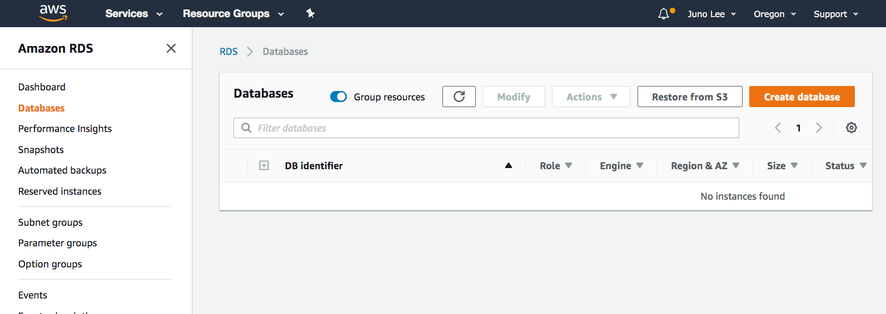

3. Select PostgreSQL on the Select Engine page.

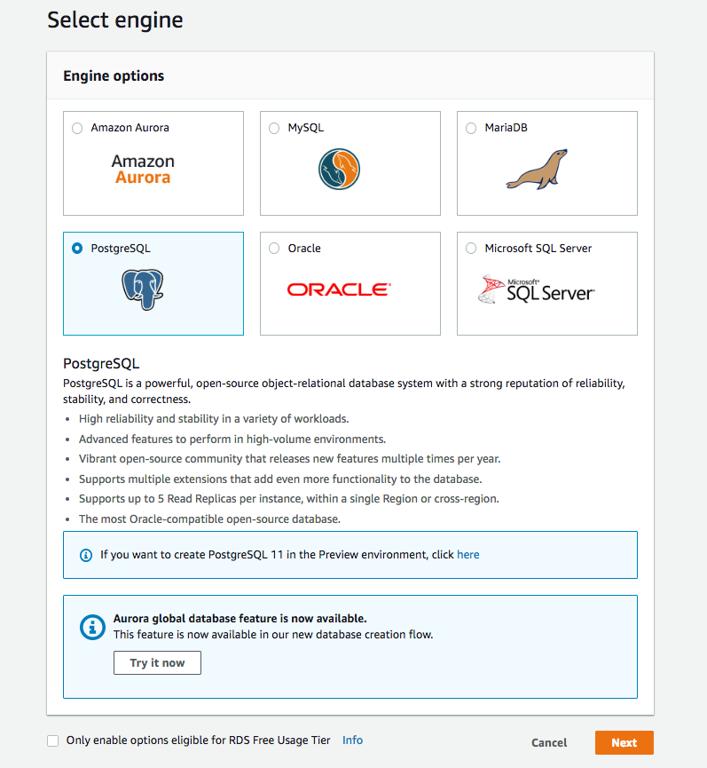

4. Since this is for demonstration purposes, select Dev/Test under Use case.

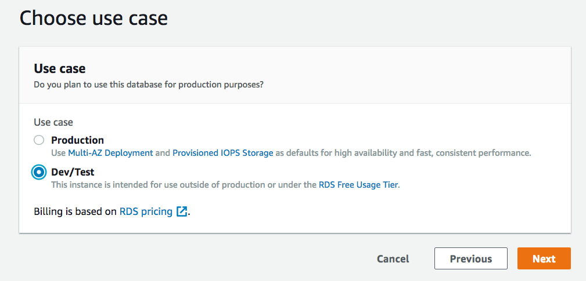

5. Next, is a long Specify DB details page. You can leave the default values (shown below) for most of these settings. Just make the following choices:
For DB instance class, select `db.t2.small`

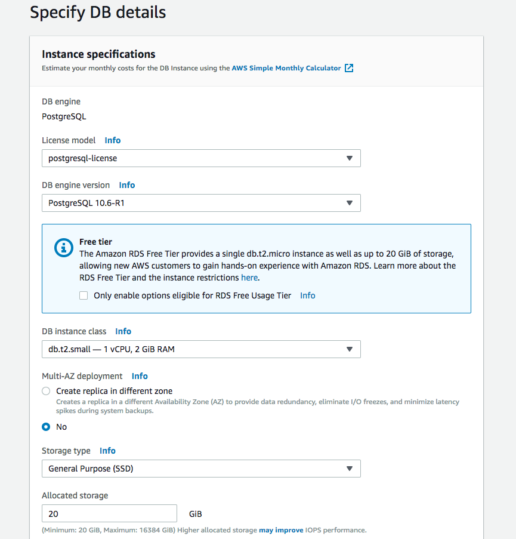

* For DB instance identifier, enter `postgreSQL-test` or another name of your choice
* Enter a master username and password

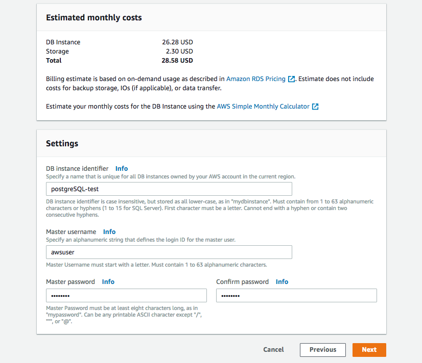

* Leave the default values for the next few sections.

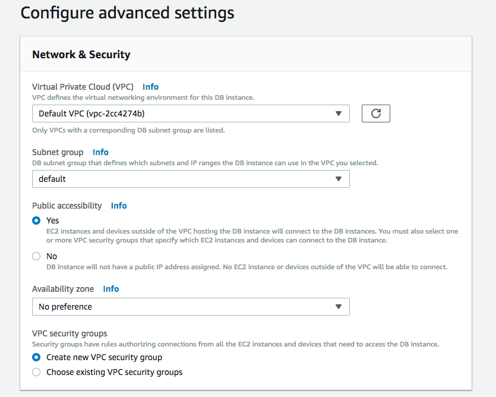

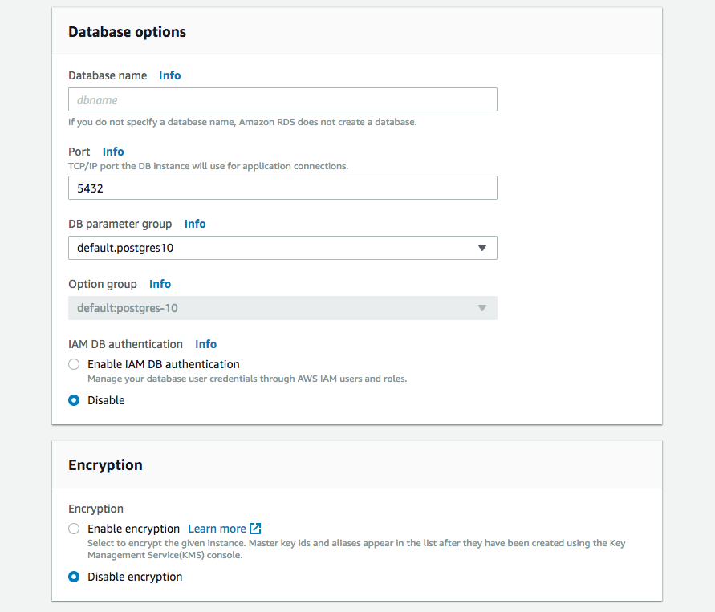

* In the Backup section and select `1 day` since this is for demonstration purposes.

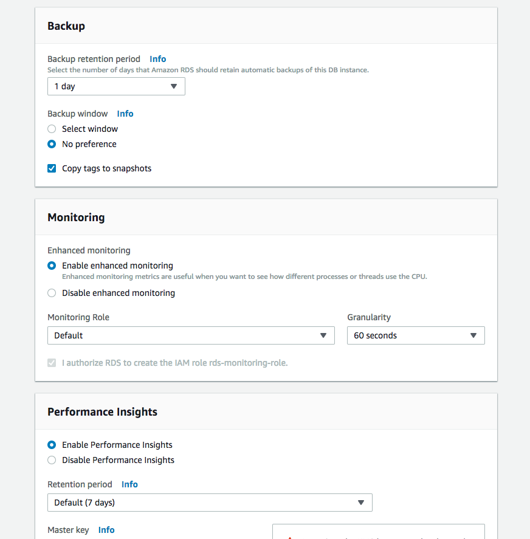

* Leave the default values for the rest and click on Create database on the bottom right.

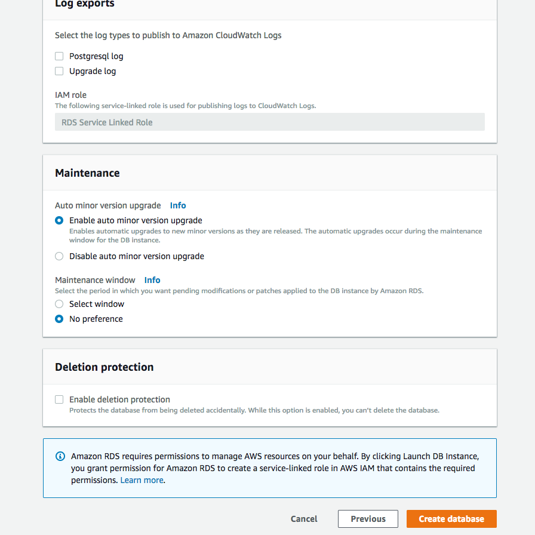

You should land on a confirmation page.

6. Click Databases on the left navigation pane to return to your list of databases. You should see your newly created database with the status Creating.

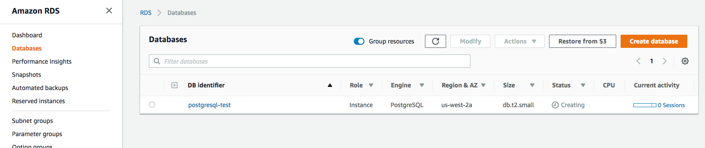

7. Wait a few minutes for this to change to the status Available.

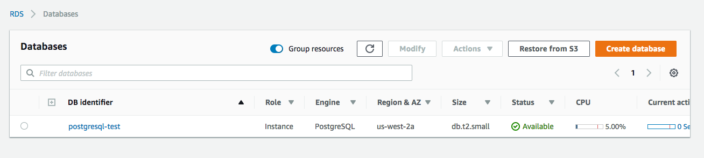

