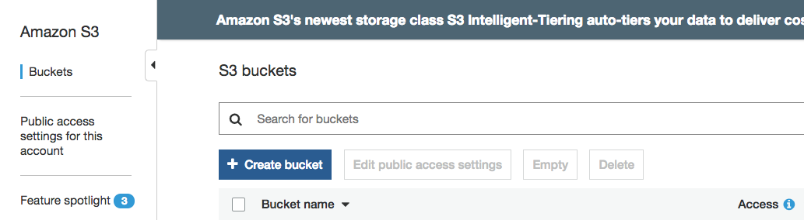
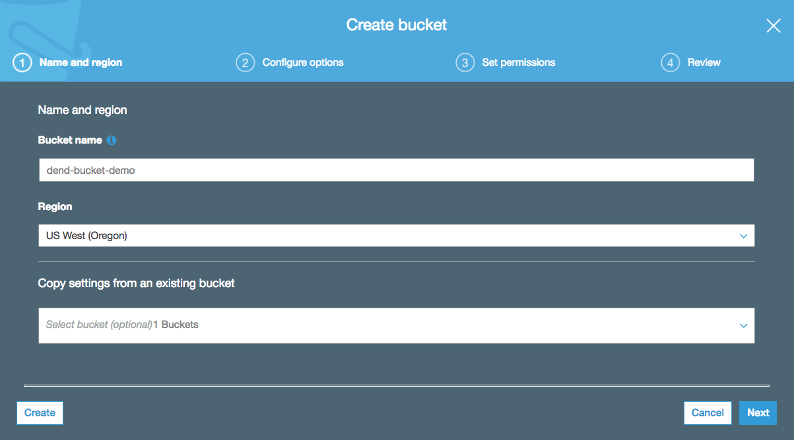
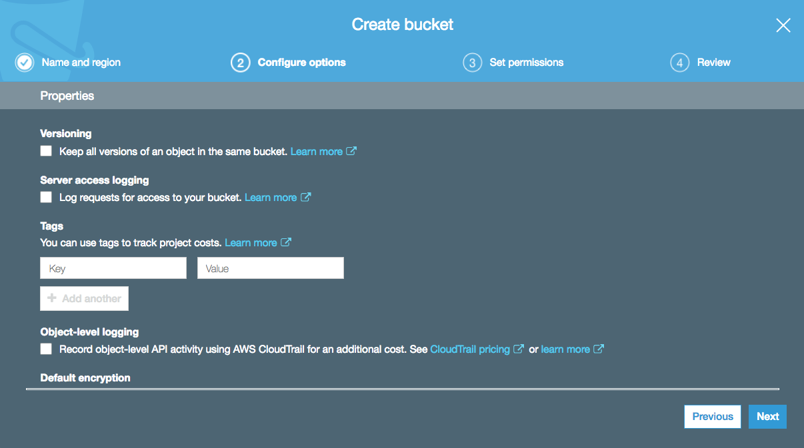
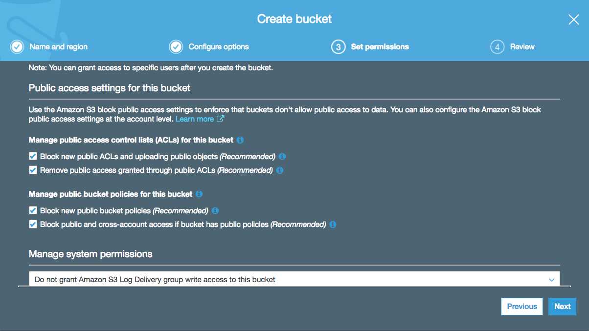
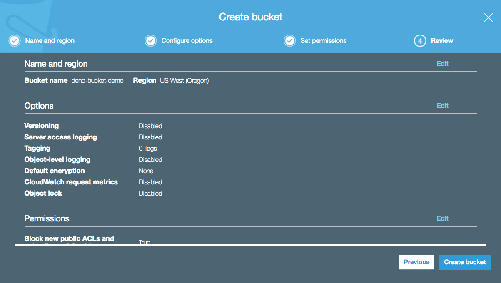
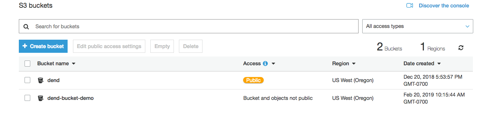
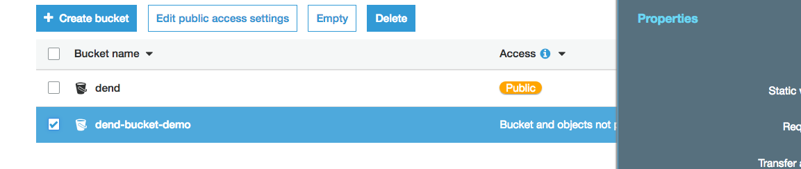
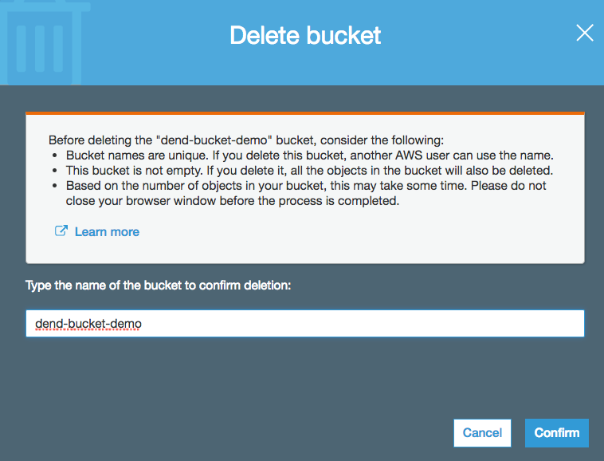

## Create an S3 Bucket
1. Go to the Amazon S3 Console and select Create bucket.

2. Enter a name for your bucket and select the region you'd like to create it in.

You won't be able to use the same name entered in the screenshot below - the names of all existing buckets on Amazon S3 are unique. You won't be able to change this name later, so choose one that makes sense for the content you'll have in it. This bucket name will be included in any URLs pointing to objects you add in your bucket.

3. Keep the default settings and select Next.

4. Specify public access settings for this bucket. For example, unchecking all of these boxes would allow anyone to be able to access this bucket. Be careful with this - you may end up having to pay lots of fees in data transfers from your bucket if you share this link and many people access large amounts of data with it. For this demo, we will leave all of these boxes checked.

5. Review your settings and select Create bucket.

6. You should now see your bucket in your list. Any buckets you've made public will be labeled so here.

## Delete S3 Bucket
To delete the bucket, select the bucket and click Delete.

Then, enter the name of the bucket and select Confirm.

